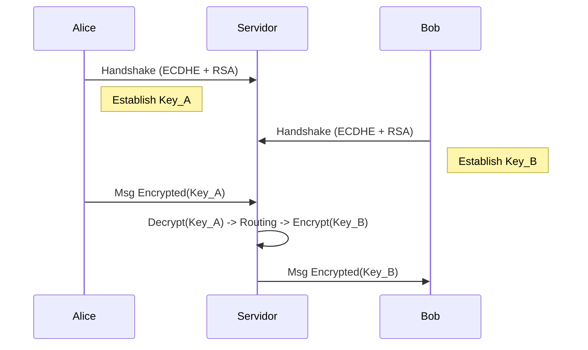

# Relatório Técnico: Sistema de Mensageria Segura

## 1. Visão Geral
Este documento descreve a arquitetura, o protocolo e os mecanismos de segurança implementados no projeto **Secure Chat**. O sistema permite a troca de mensagens cifradas entre múltiplos clientes através de um servidor central, garantindo **Confidencialidade**, **Integridade**, **Autenticidade** e **Sigilo Perfeito (Forward Secrecy)**.

## 2. Arquitetura do Sistema
O sistema segue o modelo **Cliente-Servidor** com criptografia ponta-a-ponta (no sentido de chaves de sessão exclusivas por link).



## 3. Especificação Criptográfica
O sistema utiliza um esquema híbrido de criptografia:

| Componente | Algoritmo | Parâmetros | Objeto de Proteção |
| :--- | :--- | :--- | :--- |
| **Troca de Chaves** | **ECDHE** | Curva NIST P-256 (SECP256R1) | Segredo Compartilhado (Z) |
| **Autenticação** | **RSA-PSS** | Chave 2048 bits, SHA-256 | Identidade do Servidor & Transcrito |
| **Derivação de Chaves** | **HKDF** | HMAC-SHA256 (RFC 5869) | Chaves de Sessão (c2s, s2c) |
| **Cifração Simétrica** | **AES-GCM** | 128 bits Key, 12 bytes Nonce, 16 bytes Tag | Payload da Mensagem |

## 4. Protocolo de Comunicação
Todas as mensagens seguem um cabeçalho binário fixo de **56 bytes**.

### Estrutura do Pacote
```text
 0                   1                   2                   3
 0 1 2 3 4 5 6 7 8 9 0 1 2 3 4 5 6 7 8 9 0 1 2 3 4 5 6 7 8 9 0 1
+-+-+-+-+-+-+-+-+-+-+-+-+-+-+-+-+-+-+-+-+-+-+-+-+-+-+-+-+-+-+-+-+
|                             Nonce                             |
|                           (12 Bytes)                          |
|                                                               |
+-+-+-+-+-+-+-+-+-+-+-+-+-+-+-+-+-+-+-+-+-+-+-+-+-+-+-+-+-+-+-+-+
|                           Sender ID                           |
|                           (16 Bytes)                          |
|                                                               |
|                                                               |
+-+-+-+-+-+-+-+-+-+-+-+-+-+-+-+-+-+-+-+-+-+-+-+-+-+-+-+-+-+-+-+-+
|                          Recipient ID                         |
|                           (16 Bytes)                          |
|                                                               |
|                                                               |
+-+-+-+-+-+-+-+-+-+-+-+-+-+-+-+-+-+-+-+-+-+-+-+-+-+-+-+-+-+-+-+-+
|                          Sequence No                          |
|                           (8 Bytes)                           |
+-+-+-+-+-+-+-+-+-+-+-+-+-+-+-+-+-+-+-+-+-+-+-+-+-+-+-+-+-+-+-+-+
|                        Payload Length                         |
|                           (4 Bytes)                           |
+-+-+-+-+-+-+-+-+-+-+-+-+-+-+-+-+-+-+-+-+-+-+-+-+-+-+-+-+-+-+-+-+
|                           PAYLOAD                             |
|                     (AES-GCM Ciphertext)                      |
...
+-+-+-+-+-+-+-+-+-+-+-+-+-+-+-+-+-+-+-+-+-+-+-+-+-+-+-+-+-+-+-+-+
```

## 5. Análise de Segurança

### 5.1 Confidencialidade
Garantida pelo algoritmo **AES-128-GCM**.
- **Prova**: O servidor (em modo debug) e sniffers vêm apenas bytes aleatórios.
- **AAD**: Os campos do cabeçalho (SenderID, RecipientID, SeqNo) são passados como *Associated Data*, garantindo que não podem ser alterados sem invalidar a mensagem.

### 5.2 Integridade
Garantida pela **Tag de Autenticação** (16 bytes) do AES-GCM.
- Qualquer alteração de bit no texto cifrado resulta em falha na decifragem.

### 5.3 Autenticidade
Garantida por **Assinatura RSA**.
- O servidor assina o transcrito: `pk_S || ClientID || Salt || pk_C`.
- Isso previne ataques *Man-in-the-Middle* onde um atacante tentaria se passar pelo servidor ou modificar a chave pública do cliente.

### 5.4 Sigilo Perfeito (PFS)
Garantida pelo **ECDHE**.
- Chaves privadas efêmeras são geradas a cada conexão e descartadas após o handshake.
- O comprometimento da chave RSA do servidor **não** permite decifrar sessões passadas.

### 5.5 Proteção Anti-Replay
Garantida por **Sequence Numbers Monotônicos**.
- O servidor mantém o estado `seq_recv` para cada cliente.
- Pacotes com `seq <= last_seq` são rejeitados silenciosamente.

## 6. Handshake Detalhado
1. **Client Hello**: Envia `pk_C` (PubKey Efêmera) + `ClientID`.
2. **Setup**: Servidor gera `pk_S` e `Salt`.
3. **Sign**: Servidor assina `(pk_S + ClientID + Salt + pk_C)` usando RSA Private Key.
4. **Server Hello**: Envia `pk_S`, Certificado, Assinatura e Salt.
5. **Verify**: Cliente valida Certificado e Assinatura.
6. **KDF**: Ambos derivam `Key_c2s` e `Key_s2c` usando HKDF(ECDH_Secret, Salt).

## 7. Instruções de Execução
Consulte o arquivo `README.md` na raiz do projeto.
